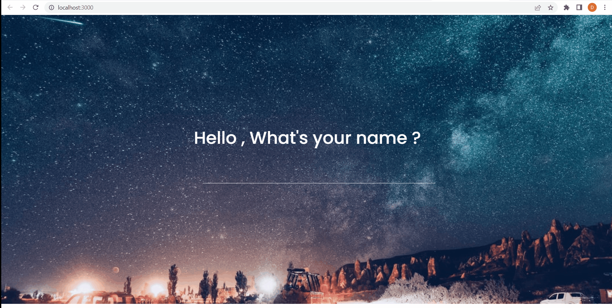

  
# Browser Tab Extension

An extension to have custom New Tab

## 

## Features

- A good user onboarding
- Display time in 24hr format.
- current weather in sync from [OpenWeather API](https://openweathermap.org/)
- Wallpaper from [Unsplash API](https://api.unsplash.com/) changing on every refresh
- Quotes changing on every refresh
- Add your main focus of the day.
- Add/delete items to todo list

### Live Link : [Lens Tab](https://lens-tab.netlify.app/)

## Instructions to run the app locally

**Follow the below steps and try it on your browser:** 

- Download and extract the [LensTab.zip](https://drive.google.com/file/d/1XofecFpzZEbbsOPq2IzlDRrZlkth87ZQ/view?usp=sharing)
- Open Google Chrome and in the address bar type `chrome://extensions/`
- Toggle the `Developer mode` from the top right corner
- Click on `Load Unpacked`
- Open to the extracted folder.
- Open New Tab and you will be greeted with the extension asking your name.
